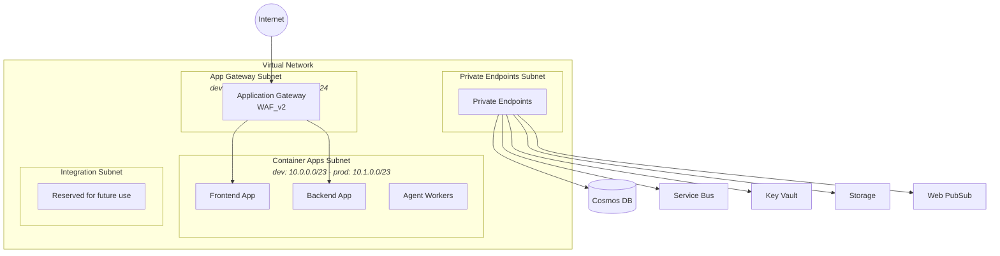
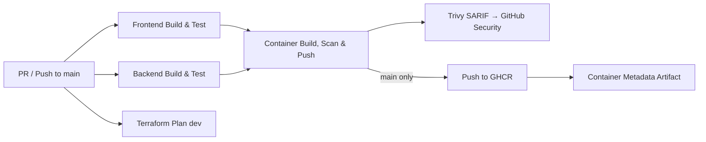

# Azure Integration Copilot

<!-- Badges -->
[](https://github.com/christopherhouse/Azure-Integration-Copilot/actions/workflows/ci.yml)
[](LICENSE)

> A multi-agent SaaS application that helps Azure Integration Services developers **understand** their systems, **manage** dependencies, **operate** effectively, and **evolve** with confidence.

---

## Table of Contents

- [Overview](#overview)
- [Technology Stack](#technology-stack)
- [Repository Structure](#repository-structure)
- [Local Development](#local-development)
- [Azure Services](#azure-services)
- [Infrastructure Architecture](#infrastructure-architecture)
  - [Network Layout](#network-layout)
  - [Managed Identities](#managed-identities)
  - [Security](#security)
  - [Conditional App Gateway Deployment](#conditional-app-gateway-deployment)
  - [Environment Differences](#environment-differences)
- [CI/CD Pipeline](#cicd-pipeline)
- [Getting Started](#getting-started)
  - [Prerequisites](#prerequisites)
  - [CI/CD Authentication Setup](#cicd-authentication-setup)
  - [First Deployment](#first-deployment)
- [Development Conventions](#development-conventions)
- [GitHub Copilot Agents](#github-copilot-agents)
- [License](#license)

---

## Overview

Azure Integration Copilot is a **multi-tenant SaaS application** running on Azure. Built as a multi-agent solution using the [Microsoft Foundry](https://learn.microsoft.com/en-us/azure/ai-services/) agent framework, it assists Azure Integration Services developers throughout the full lifecycle of their solutions — from planning and understanding system dependencies to day-to-day operations and future evolution.

The application consists of a **Next.js frontend**, a **Python backend**, and **asynchronous agent workers**, all hosted on Azure Container Apps with real-time updates delivered via Azure Web PubSub.

---

## Technology Stack

| Layer | Technology |
|---|---|
| **Frontend** | Next.js (App Router), TypeScript (strict mode), Azure Container Apps |
| **Backend** | Python 3.13, FastAPI, UV package manager, Azure Container Apps |
| **Agent Workers** | Azure Container Apps with KEDA scalers, Azure Service Bus triggers |
| **Agent Framework** | Microsoft Foundry |
| **Infrastructure** | Terraform with [Azure Verified Modules (AVM)](https://azure.github.io/Azure-Verified-Modules/) |
| **CI/CD** | GitHub Actions with OIDC authentication to Azure |

---

## Repository Structure

```text
├── .github/
│   ├── agents/                  # GitHub Copilot custom agent definitions (10 agents)
│   ├── workflows/
│   │   └── ci.yml               # CI pipeline (build, test, scan, push)
│   └── copilot-instructions.md  # Shared Copilot coding instructions
├── src/
│   ├── frontend/                # Next.js application (TypeScript)
│   ├── backend/                 # Python 3.13 backend services (UV)
│   └── agents/                  # Microsoft Foundry agent definitions
├── infra/
│   └── terraform/
│       ├── modules/             # 11 reusable Terraform modules (AVM-based)
│       │   ├── app_gateway/         # Application Gateway WAF_v2
│       │   ├── container_apps/      # Container Apps Environment + apps
│       │   ├── container_registry/  # Azure Container Registry
│       │   ├── cosmos_db/           # Cosmos DB (serverless)
│       │   ├── key_vault/           # Azure Key Vault
│       │   ├── managed_identity/    # User Assigned Managed Identities
│       │   ├── networking/          # VNet, subnets, NSGs, Private DNS
│       │   ├── observability/       # Log Analytics + Application Insights
│       │   ├── service_bus/         # Azure Service Bus
│       │   ├── storage/             # Azure Storage Account
│       │   └── web_pubsub/          # Azure Web PubSub
│       └── environments/
│           ├── dev/                 # Development environment config
│           └── prod/                # Production environment config
├── docs/                        # Project documentation
├── tests/
│   ├── frontend/                # Frontend tests
│   ├── backend/                 # Backend tests
│   └── integration/             # End-to-end / integration tests
├── LICENSE                      # MIT License
└── README.md                    # This file
```

---

## Local Development

Get up and running quickly with the backend and frontend:

```bash
# Backend (Python 3.13 + FastAPI)
cd src/backend
uv sync                                          # Install dependencies
uv run uvicorn main:app --reload --port 8000     # Start dev server

# Frontend (Next.js 16 + TypeScript)
cd src/frontend
npm install                                      # Install dependencies
npm run dev                                      # Start dev server

# Or start both services with Docker Compose
make up
```

| Command | Description |
|---------|-------------|
| `make dev-backend` | Start backend with hot reload |
| `make dev-frontend` | Start frontend with hot reload |
| `make lint` | Run linters for both projects |
| `make test` | Run tests for both projects |
| `make build` | Build Docker images |
| `make up` | Build and start both services |

For the full developer guide — including setup, testing, and tooling details — see **[docs/guides/developer-guide.md](docs/guides/developer-guide.md)**.

---

## Azure Services

| Service | Purpose |
|---|---|
| **Azure Application Gateway** | Internet-facing ingress with WAF, TLS termination, Key Vault certificate integration |
| **Azure Container Apps** | Hosts the frontend, backend, and async agent workers |
| **Azure Container Registry** | Private container image storage |
| **Azure Cosmos DB** | Multi-tenant data storage (serverless mode) |
| **Azure Service Bus** | Asynchronous messaging between services and agent workers |
| **Microsoft Foundry** | Agent framework and orchestration |
| **Azure Key Vault** | Secrets and TLS certificate management |
| **Azure Storage** | Blob, queue, and table storage |
| **Azure Web PubSub** | Real-time messaging for live agent updates to clients |
| **Virtual Network** | Network isolation with four dedicated subnets |
| **Private Endpoints** | Secure connectivity to all PaaS services |
| **User Assigned Managed Identities** | RBAC-based authentication for frontend, backend, and App Gateway |

---

## Infrastructure Architecture

All infrastructure is defined as Terraform using [Azure Verified Modules (AVM)](https://azure.github.io/Azure-Verified-Modules/). Each environment (`dev`, `prod`) has its own state file and configuration.

### Network Layout



- **Container Apps subnet** — Delegated to the Container Apps Environment with an internal load balancer.
- **App Gateway subnet** — WAF_v2 with NSG rules for GatewayManager, Azure Load Balancer, and HTTP/HTTPS traffic.
- **Private Endpoints subnet** — Secure connectivity to PaaS services over the VNet backbone.
- **Integration subnet** — Reserved for future integrations.

### Managed Identities

Three **User Assigned Managed Identities** (UAMIs) are provisioned per environment:

| Identity | Resource ID Pattern | Assignment |
|---|---|---|
| Frontend UAMI | `id-frontend-*` | Frontend Container App |
| Backend UAMI | `id-backend-*` | Backend Container App |
| App Gateway UAMI | `id-agw-*` | Application Gateway — includes *Key Vault Secrets User* role for TLS certificate retrieval |

### Security

All services follow a **zero-trust, private-by-default** posture:

- **Private Endpoints** on all PaaS services — no public internet exposure.
- **Key Vault** — Public access disabled, network ACLs default deny, bypass for Azure services only.
- **Cosmos DB & Service Bus** — Local authentication disabled; Entra ID auth required.
- **Storage** — Shared access keys disabled; defaults to OAuth/Entra ID.
- **Terraform state** — Stored in Azure Storage with Entra ID authentication.
- **All service-to-service auth** — Via User Assigned Managed Identities and Azure RBAC.

### Conditional App Gateway Deployment

The Application Gateway deployment is controlled by the `deploy_app_gateway` variable (default: `false`). This solves a **chicken-and-egg problem** where the gateway needs TLS certificates that are stored in a Key Vault that hasn't been created yet.

```text
Deployment 1 ──► deploy_app_gateway = false ──► Key Vault + all other resources created
                                                     │
                                          Upload TLS certificates to Key Vault
                                                     │
Deployment 2 ──► deploy_app_gateway = true  ──► Application Gateway created with cert references
```

### Environment Differences

| Component | Dev | Prod |
|---|---|---|
| VNet Address Space | `10.0.0.0/16` | `10.1.0.0/16` |
| Log Retention | 30 days | 90 days |
| Key Vault Soft Delete | 7 days | 90 days |
| Container Registry SKU | Basic | Standard |
| Service Bus SKU | Standard (no PE) | Premium (with PE) |
| Web PubSub SKU | Free F1 (no PE) | Standard S1 (with PE) |
| App Gateway Scaling | min 0 / max 2 | min 1 / max 10 |
| Container App Replicas | min 0 (scale to zero) | min 1 (always warm) |

---

## CI/CD Pipeline

The CI workflow (`.github/workflows/ci.yml`) runs on every PR and push to `main`. It uses **OIDC federated credentials** for Azure authentication — no stored secrets or service principal passwords.



| Job | Trigger | Description |
|---|---|---|
| **Frontend Build & Test** | Every PR and push | `npm ci`, ESLint, Next.js build, Jest tests with JUnit reporting |
| **Backend Build & Test** | Every PR and push | UV dependency sync, Ruff lint, pytest with JUnit reporting |
| **Terraform Plan (dev)** | Every PR and push | OIDC Azure login, `terraform plan`, uploads plan artifact (7-day retention) |
| **Containers** | After tests pass | Docker Buildx build, Trivy scan (CRITICAL/HIGH → SARIF), push to GHCR on `main`, container metadata JSON artifact (90-day retention) |

Container images are published to GHCR at `ghcr.io/<owner>/<repo>/frontend` and `ghcr.io/<owner>/<repo>/backend`, tagged with the 7-character commit SHA and `latest` on pushes to `main`.

---

## Getting Started

### Prerequisites

| Requirement | Details |
|---|---|
| Terraform | `>= 1.11` recommended (local modules declare `>= 1.9.0` but AVM dependencies require `~> 1.11`) |
| Azure Subscription | With permissions to create the resources listed in [Azure Services](#azure-services) |
| Azure AD Tenant | For managed identity provisioning and RBAC assignments |
| GitHub OIDC Secrets | `AZURE_CLIENT_ID_DEV`, `AZURE_CLIENT_ID_PROD`, `AZURE_SUBSCRIPTION_ID_DEV`, `AZURE_SUBSCRIPTION_ID_PROD`, `AZURE_TENANT_ID` |

### CI/CD Authentication Setup

The CI/CD pipeline authenticates to Azure using **OpenID Connect (OIDC) federated credentials** — no secrets or passwords are stored in GitHub. Terraform state is stored in Azure Storage with **Entra ID authentication only** (shared access keys are disabled).

Complete the steps below once per environment (`dev` and `prod`). Replace `<LOCATION>` with your preferred Azure region (e.g. `eastus2`).

#### 1. Create Entra ID App Registrations

Create one App Registration per environment. Each gets its own service principal that the GitHub Actions workflow uses to deploy resources.

```bash
# Dev
az ad app create --display-name "github-aic-dev"
DEV_APP_ID=$(az ad app list --display-name "github-aic-dev" --query "[0].appId" -o tsv)
az ad sp create --id $DEV_APP_ID

# Prod
az ad app create --display-name "github-aic-prod"
PROD_APP_ID=$(az ad app list --display-name "github-aic-prod" --query "[0].appId" -o tsv)
az ad sp create --id $PROD_APP_ID
```

#### 2. Add Federated Credentials for GitHub Actions

Federated credentials let GitHub Actions exchange its OIDC token for an Azure access token without storing a client secret. Create one credential per app registration, scoped to the matching GitHub Actions **environment**.

> Replace `<OWNER>/<REPO>` with your GitHub repository (e.g. `christopherhouse/Azure-Integration-Copilot`).

```bash
# Dev — trusts the "dev" GitHub environment
az ad app federated-credential create --id $DEV_APP_ID --parameters '{
  "name": "github-actions-dev",
  "issuer": "https://token.actions.githubusercontent.com",
  "subject": "repo:<OWNER>/<REPO>:environment:dev",
  "audiences": ["api://AzureADTokenExchange"],
  "description": "GitHub Actions OIDC — dev environment"
}'

# Prod — trusts the "prod" GitHub environment
az ad app federated-credential create --id $PROD_APP_ID --parameters '{
  "name": "github-actions-prod",
  "issuer": "https://token.actions.githubusercontent.com",
  "subject": "repo:<OWNER>/<REPO>:environment:prod",
  "audiences": ["api://AzureADTokenExchange"],
  "description": "GitHub Actions OIDC — prod environment"
}'
```

> **Why `environment:` subjects?** The workflow declares `environment: dev` and `environment: prod` on its plan/apply jobs. The federated credential subject must match the environment name exactly, otherwise the token exchange will fail.

#### 3. Create Terraform State Storage Accounts

Each environment stores its state in a dedicated storage account with **shared access keys disabled** so that all access goes through Entra ID RBAC.

```bash
# Shared resource group for state storage
az group create --name rg-tfstate-aic --location <LOCATION>

# Dev state storage
az storage account create \
  --name sttfstateaicdev \
  --resource-group rg-tfstate-aic \
  --location <LOCATION> \
  --sku Standard_LRS \
  --allow-blob-public-access false \
  --allow-shared-key-access false

az storage container create \
  --name tfstate \
  --account-name sttfstateaicdev \
  --auth-mode login

# Prod state storage
az storage account create \
  --name sttfstateaicprod \
  --resource-group rg-tfstate-aic \
  --location <LOCATION> \
  --sku Standard_LRS \
  --allow-blob-public-access false \
  --allow-shared-key-access false

az storage container create \
  --name tfstate \
  --account-name sttfstateaicprod \
  --auth-mode login
```

> The backend configuration in `infra/terraform/environments/*/backend.tf` already sets `use_azuread_auth = true`, which tells the AzureRM provider to authenticate to the storage account using Entra ID instead of storage account keys.

#### 4. Assign RBAC Roles

Each service principal needs two roles:

| Role | Scope | Purpose |
|---|---|---|
| **Storage Blob Data Contributor** | State storage account | Read/write Terraform state blobs |
| **Contributor** | Target Azure subscription | Create and manage Azure resources |

```bash
# Dev
DEV_SP_OBJECT_ID=$(az ad sp show --id $DEV_APP_ID --query id -o tsv)
DEV_STORAGE_ID=$(az storage account show --name sttfstateaicdev \
  --resource-group rg-tfstate-aic --query id -o tsv)
DEV_SUB_ID="<DEV_SUBSCRIPTION_ID>"   # your dev Azure subscription ID

az role assignment create \
  --assignee-object-id $DEV_SP_OBJECT_ID \
  --assignee-principal-type ServicePrincipal \
  --role "Storage Blob Data Contributor" \
  --scope $DEV_STORAGE_ID

az role assignment create \
  --assignee-object-id $DEV_SP_OBJECT_ID \
  --assignee-principal-type ServicePrincipal \
  --role "Contributor" \
  --scope "/subscriptions/$DEV_SUB_ID"

# Prod
PROD_SP_OBJECT_ID=$(az ad sp show --id $PROD_APP_ID --query id -o tsv)
PROD_STORAGE_ID=$(az storage account show --name sttfstateaicprod \
  --resource-group rg-tfstate-aic --query id -o tsv)
PROD_SUB_ID="<PROD_SUBSCRIPTION_ID>"   # your prod Azure subscription ID

az role assignment create \
  --assignee-object-id $PROD_SP_OBJECT_ID \
  --assignee-principal-type ServicePrincipal \
  --role "Storage Blob Data Contributor" \
  --scope $PROD_STORAGE_ID

az role assignment create \
  --assignee-object-id $PROD_SP_OBJECT_ID \
  --assignee-principal-type ServicePrincipal \
  --role "Contributor" \
  --scope "/subscriptions/$PROD_SUB_ID"
```

#### 5. Configure GitHub Secrets

In your GitHub repository, go to **Settings → Environments** and create `dev` and `prod` environments. Then add the following secrets:

**Environment secrets** (scoped to their respective environment):

| Secret | Environment | Value |
|---|---|---|
| `AZURE_CLIENT_ID` | `dev` | Application (client) ID of the dev App Registration |
| `AZURE_SUBSCRIPTION_ID` | `dev` | Azure subscription ID for the dev environment |
| `AZURE_CLIENT_ID` | `prod` | Application (client) ID of the prod App Registration |
| `AZURE_SUBSCRIPTION_ID` | `prod` | Azure subscription ID for the prod environment |

**Repository secret** (shared across all environments):

| Secret | Value |
|---|---|
| `AZURE_TENANT_ID` | Directory (tenant) ID of your Entra ID tenant |

> **Tip:** `AZURE_CLIENT_ID` and `AZURE_SUBSCRIPTION_ID` use the same secret name in both environments — GitHub scopes them to the environment declared on each workflow job. `AZURE_TENANT_ID` is a repository-level secret since it's shared across all environments.

Once complete, the CI workflow (`.github/workflows/ci.yml`) will authenticate to Azure using OIDC without any stored passwords or access keys.

### First Deployment

1. **Configure environment variables** — Edit the tfvars file (`dev.tfvars` or `prod.tfvars`) and set your `tenant_id`, listener hostnames, and any other environment-specific values.

2. **Deploy infrastructure (without App Gateway)**

   ```bash
   cd infra/terraform/environments/dev
   terraform init
   terraform plan -var-file="dev.tfvars"
   terraform apply -var-file="dev.tfvars"
   ```

   > `deploy_app_gateway` defaults to `false`, so the Application Gateway is skipped.
   >
   > In CI, `tenant_id` is injected from GitHub secrets via `-var="tenant_id=..."` to avoid committing real values.

3. **Upload TLS certificates** — Add your TLS certificates to the provisioned Key Vault (manual or automated).

4. **Deploy Application Gateway** — Update `deploy_app_gateway = true` and the certificate secret URIs in your tfvars, then apply again:

   ```bash
   terraform apply -var-file="dev.tfvars"
   ```

---

## Development Conventions

| Area | Convention |
|---|---|
| **Terraform** | Use [Azure Verified Modules (AVM)](https://azure.github.io/Azure-Verified-Modules/) for all resources |
| **Python** | UV for dependency management (not pip); PEP 8 with type hints on all function signatures |
| **TypeScript** | Next.js App Router conventions; server components by default; strict mode enabled |
| **Authentication** | User Assigned Managed Identities everywhere — no connection strings or shared keys |
| **Cost** | Prefer serverless and consumption-based SKUs; scale to zero in dev environments |

---

## GitHub Copilot Agents

The repository includes **10 custom GitHub Copilot agent definitions** in `.github/agents/`, each specializing in a different aspect of the project:

| Agent | Responsibility |
|---|---|
| `cloud-security-engineer` | Security assessments aligned to Microsoft Cloud Security Benchmarks |
| `devops-engineer` | CI/CD pipeline design and GitHub Actions workflows |
| `foundry-engineer` | Microsoft Foundry agent development |
| `orchestrator` | Coordinates planning and execution across specialist agents |
| `planner` | Produces phased execution plans from user prompts |
| `qa-engineer` | Test strategy, implementation, and review |
| `saas-architect` | Multi-tenant SaaS architecture on Azure |
| `tech-writer` | Documentation creation and maintenance |
| `terraform-engineer` | Infrastructure-as-code with Terraform and AVM |
| `ux-designer` | User experience and information architecture guidance |

---

## License

This project is licensed under the **MIT License** — see the [LICENSE](LICENSE) file for details.
