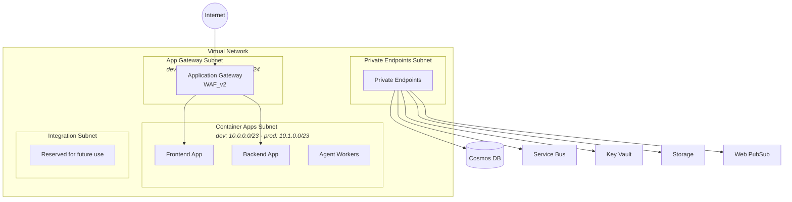
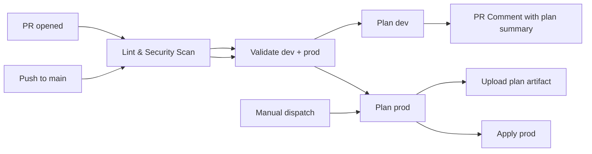

# Azure Integration Copilot

<!-- Badges -->
[](https://github.com/yourorg/Azure-Integration-Copilot/actions/workflows/terraform.yml)
[](LICENSE)

> A multi-agent SaaS application that helps Azure Integration Services developers **understand** their systems, **manage** dependencies, **operate** effectively, and **evolve** with confidence.

---

## Table of Contents

- [Overview](#overview)
- [Technology Stack](#technology-stack)
- [Repository Structure](#repository-structure)
- [Azure Services](#azure-services)
- [Infrastructure Architecture](#infrastructure-architecture)
  - [Network Layout](#network-layout)
  - [Managed Identities](#managed-identities)
  - [Security](#security)
  - [Conditional App Gateway Deployment](#conditional-app-gateway-deployment)
  - [Environment Differences](#environment-differences)
- [CI/CD Pipeline](#cicd-pipeline)
- [Getting Started](#getting-started)
  - [Prerequisites](#prerequisites)
  - [First Deployment](#first-deployment)
- [Development Conventions](#development-conventions)
- [GitHub Copilot Agents](#github-copilot-agents)
- [License](#license)

---

## Overview

Azure Integration Copilot is a **multi-tenant SaaS application** running on Azure. Built as a multi-agent solution using the [Microsoft Foundry](https://learn.microsoft.com/en-us/azure/ai-services/) agent framework, it assists Azure Integration Services developers throughout the full lifecycle of their solutions — from planning and understanding system dependencies to day-to-day operations and future evolution.

The application consists of a **Next.js frontend**, a **Python backend**, and **asynchronous agent workers**, all hosted on Azure Container Apps with real-time updates delivered via Azure Web PubSub.

---

## Technology Stack

| Layer | Technology |
|---|---|
| **Frontend** | Next.js (App Router), TypeScript (strict mode), Azure Container Apps |
| **Backend** | Python 3.13, UV package manager, Azure Container Apps |
| **Agent Workers** | Azure Container Apps with KEDA scalers, Azure Service Bus triggers |
| **Agent Framework** | Microsoft Foundry |
| **Infrastructure** | Terraform with [Azure Verified Modules (AVM)](https://azure.github.io/Azure-Verified-Modules/) |
| **CI/CD** | GitHub Actions with OIDC authentication to Azure |

---

## Repository Structure

```text
├── .github/
│   ├── agents/                  # GitHub Copilot custom agent definitions (10 agents)
│   ├── workflows/
│   │   └── terraform.yml        # Terraform CI/CD pipeline
│   └── copilot-instructions.md  # Shared Copilot coding instructions
├── src/
│   ├── frontend/                # Next.js application (TypeScript)
│   ├── backend/                 # Python 3.13 backend services (UV)
│   └── agents/                  # Microsoft Foundry agent definitions
├── infra/
│   └── terraform/
│       ├── modules/             # 11 reusable Terraform modules (AVM-based)
│       │   ├── app_gateway/         # Application Gateway WAF_v2
│       │   ├── container_apps/      # Container Apps Environment + apps
│       │   ├── container_registry/  # Azure Container Registry
│       │   ├── cosmos_db/           # Cosmos DB (serverless)
│       │   ├── key_vault/           # Azure Key Vault
│       │   ├── managed_identity/    # User Assigned Managed Identities
│       │   ├── networking/          # VNet, subnets, NSGs, Private DNS
│       │   ├── observability/       # Log Analytics + Application Insights
│       │   ├── service_bus/         # Azure Service Bus
│       │   ├── storage/             # Azure Storage Account
│       │   └── web_pubsub/          # Azure Web PubSub
│       └── environments/
│           ├── dev/                 # Development environment config
│           └── prod/                # Production environment config
├── docs/                        # Project documentation
├── tests/
│   ├── frontend/                # Frontend tests
│   ├── backend/                 # Backend tests
│   └── integration/             # End-to-end / integration tests
├── LICENSE                      # MIT License
└── README.md                    # This file
```

---

## Azure Services

| Service | Purpose |
|---|---|
| **Azure Application Gateway** | Internet-facing ingress with WAF, TLS termination, Key Vault certificate integration |
| **Azure Container Apps** | Hosts the frontend, backend, and async agent workers |
| **Azure Container Registry** | Private container image storage |
| **Azure Cosmos DB** | Multi-tenant data storage (serverless mode) |
| **Azure Service Bus** | Asynchronous messaging between services and agent workers |
| **Microsoft Foundry** | Agent framework and orchestration |
| **Azure Key Vault** | Secrets and TLS certificate management |
| **Azure Storage** | Blob, queue, and table storage |
| **Azure Web PubSub** | Real-time messaging for live agent updates to clients |
| **Virtual Network** | Network isolation with four dedicated subnets |
| **Private Endpoints** | Secure connectivity to all PaaS services |
| **User Assigned Managed Identities** | RBAC-based authentication for frontend, backend, and App Gateway |

---

## Infrastructure Architecture

All infrastructure is defined as Terraform using [Azure Verified Modules (AVM)](https://azure.github.io/Azure-Verified-Modules/). Each environment (`dev`, `prod`) has its own state file and configuration.

### Network Layout



- **Container Apps subnet** — Delegated to the Container Apps Environment with an internal load balancer.
- **App Gateway subnet** — WAF_v2 with NSG rules for GatewayManager, Azure Load Balancer, and HTTP/HTTPS traffic.
- **Private Endpoints subnet** — Secure connectivity to PaaS services over the VNet backbone.
- **Integration subnet** — Reserved for future integrations.

### Managed Identities

Three **User Assigned Managed Identities** (UAMIs) are provisioned per environment:

| Identity | Resource ID Pattern | Assignment |
|---|---|---|
| Frontend UAMI | `id-frontend-*` | Frontend Container App |
| Backend UAMI | `id-backend-*` | Backend Container App |
| App Gateway UAMI | `id-agw-*` | Application Gateway — includes *Key Vault Secrets User* role for TLS certificate retrieval |

### Security

All services follow a **zero-trust, private-by-default** posture:

- **Private Endpoints** on all PaaS services — no public internet exposure.
- **Key Vault** — Public access disabled, network ACLs default deny, bypass for Azure services only.
- **Cosmos DB & Service Bus** — Local authentication disabled; Entra ID auth required.
- **Storage** — Shared access keys disabled; defaults to OAuth/Entra ID.
- **Terraform state** — Stored in Azure Storage with Entra ID authentication.
- **All service-to-service auth** — Via User Assigned Managed Identities and Azure RBAC.

### Conditional App Gateway Deployment

The Application Gateway deployment is controlled by the `deploy_app_gateway` variable (default: `false`). This solves a **chicken-and-egg problem** where the gateway needs TLS certificates that are stored in a Key Vault that hasn't been created yet.

```text
Deployment 1 ──► deploy_app_gateway = false ──► Key Vault + all other resources created
                                                     │
                                          Upload TLS certificates to Key Vault
                                                     │
Deployment 2 ──► deploy_app_gateway = true  ──► Application Gateway created with cert references
```

### Environment Differences

| Component | Dev | Prod |
|---|---|---|
| VNet Address Space | `10.0.0.0/16` | `10.1.0.0/16` |
| Log Retention | 30 days | 90 days |
| Key Vault Soft Delete | 7 days | 90 days |
| Container Registry SKU | Basic | Standard |
| Service Bus SKU | Standard (no PE) | Premium (with PE) |
| Web PubSub SKU | Free F1 (no PE) | Standard S1 (with PE) |
| App Gateway Scaling | min 0 / max 2 | min 1 / max 10 |
| Container App Replicas | min 0 (scale to zero) | min 1 (always warm) |

---

## CI/CD Pipeline

The Terraform pipeline (`.github/workflows/terraform.yml`) uses **OIDC federated credentials** for Azure authentication — no stored secrets or service principal passwords.



### Pipeline Stages

| Stage | Trigger | Description |
|---|---|---|
| **Lint & Security Scan** | Every PR and push | `terraform fmt` check, [TFLint](https://github.com/terraform-linters/tflint) with azurerm plugin, [Checkov](https://www.checkov.io/) security scan |
| **Validate** | Every PR and push | `terraform init -backend=false` + `terraform validate` for both `dev` and `prod` |
| **Plan dev** | Pull requests | Creates a plan artifact; posts a summary as a PR comment |
| **Plan prod** | Push to `main` | Creates a plan artifact for production |
| **Apply prod** | `workflow_dispatch` only | Downloads the plan artifact and applies — requires manual approval |

---

## Getting Started

### Prerequisites

| Requirement | Details |
|---|---|
| Terraform | `>= 1.9.8` (pinned in the workflow; AVM Container Apps module requires `>= 1.11`) |
| Azure Subscription | With permissions to create the resources listed in [Azure Services](#azure-services) |
| Azure AD Tenant | For managed identity provisioning and RBAC assignments |
| GitHub OIDC Secrets | `AZURE_CLIENT_ID_DEV`, `AZURE_CLIENT_ID_PROD`, `AZURE_SUBSCRIPTION_ID_DEV`, `AZURE_SUBSCRIPTION_ID_PROD`, `AZURE_TENANT_ID` |

### First Deployment

1. **Configure environment variables** — Set `tenant_id` and listener hostnames in the appropriate tfvars file (`dev.tfvars` or `prod.tfvars`).

2. **Deploy infrastructure (without App Gateway)**

   ```bash
   cd infra/terraform/environments/dev
   terraform init
   terraform plan -var-file="dev.tfvars" -var="tenant_id=<YOUR_TENANT_ID>"
   terraform apply -var-file="dev.tfvars" -var="tenant_id=<YOUR_TENANT_ID>"
   ```

   > `deploy_app_gateway` defaults to `false`, so the Application Gateway is skipped.

3. **Upload TLS certificates** — Add your TLS certificates to the provisioned Key Vault (manual or automated).

4. **Deploy Application Gateway** — Update `deploy_app_gateway = true` and the certificate secret URIs in your tfvars, then apply again:

   ```bash
   terraform apply -var-file="dev.tfvars" -var="tenant_id=<YOUR_TENANT_ID>"
   ```

---

## Development Conventions

| Area | Convention |
|---|---|
| **Terraform** | Use [Azure Verified Modules (AVM)](https://azure.github.io/Azure-Verified-Modules/) for all resources |
| **Python** | UV for dependency management (not pip); PEP 8 with type hints on all function signatures |
| **TypeScript** | Next.js App Router conventions; server components by default; strict mode enabled |
| **Authentication** | User Assigned Managed Identities everywhere — no connection strings or shared keys |
| **Cost** | Prefer serverless and consumption-based SKUs; scale to zero in dev environments |

---

## GitHub Copilot Agents

The repository includes **10 custom GitHub Copilot agent definitions** in `.github/agents/`, each specializing in a different aspect of the project:

| Agent | Responsibility |
|---|---|
| `cloud-security-engineer` | Security assessments aligned to Microsoft Cloud Security Benchmarks |
| `devops-engineer` | CI/CD pipeline design and GitHub Actions workflows |
| `foundry-engineer` | Microsoft Foundry agent development |
| `orchestrator` | Coordinates planning and execution across specialist agents |
| `planner` | Produces phased execution plans from user prompts |
| `qa-engineer` | Test strategy, implementation, and review |
| `saas-architect` | Multi-tenant SaaS architecture on Azure |
| `tech-writer` | Documentation creation and maintenance |
| `terraform-engineer` | Infrastructure-as-code with Terraform and AVM |
| `ux-designer` | User experience and information architecture guidance |

---

## License

This project is licensed under the **MIT License** — see the [LICENSE](LICENSE) file for details.
