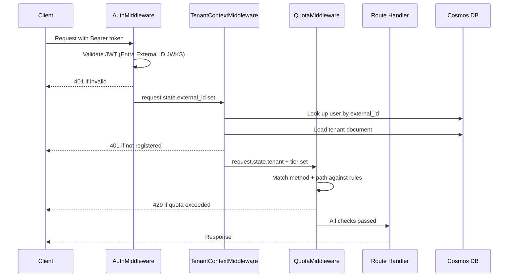
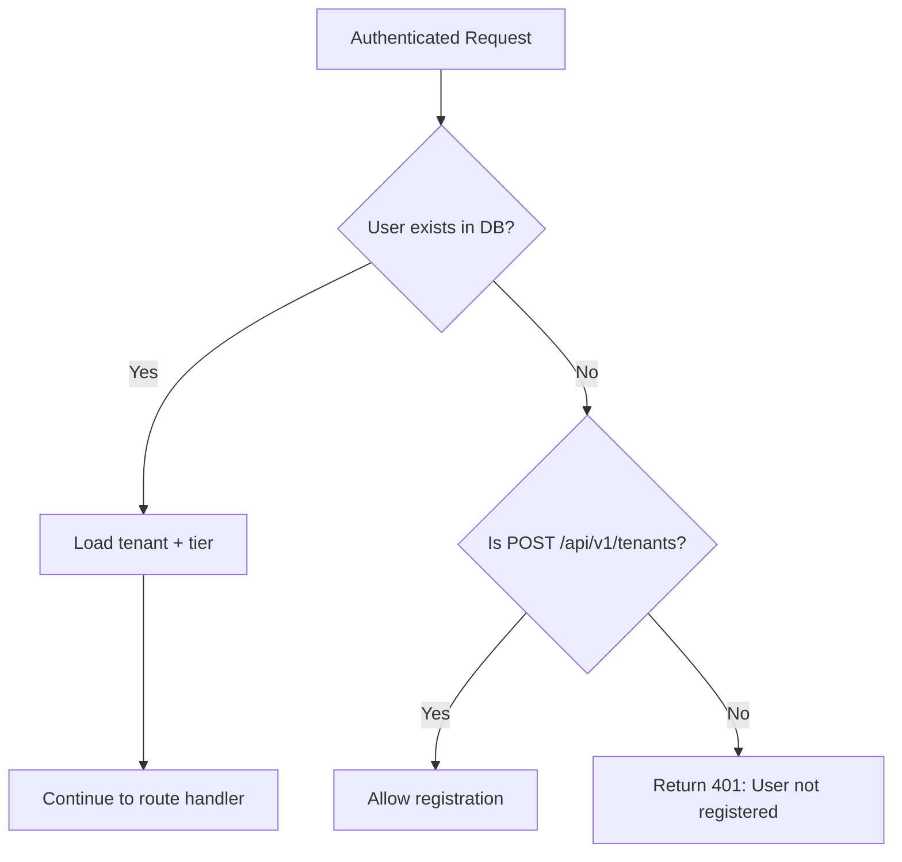
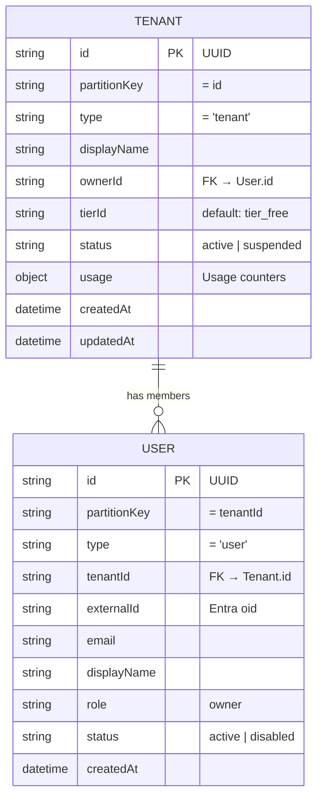

# 🔐 Tenancy, Authentication & Quota Architecture

> **Task:** [004 — Tenancy, Auth, and Subscription Foundation](../plan/tasks/004-tenancy-auth-and-subscription-foundation.md)
> **Status:** ✅ Completed

This document describes the authentication, multi-tenancy, and quota enforcement systems that form the foundation of the Azure Integration Copilot backend.

---

## Table of Contents

- [Overview](#overview)
- [Request Lifecycle](#request-lifecycle)
- [Authentication](#authentication)
  - [JWT Validation](#jwt-validation)
  - [Development Mode](#development-mode)
- [Tenant Resolution](#tenant-resolution)
  - [Registration Flow](#registration-flow)
  - [Data Model](#data-model)
- [Tier System](#tier-system)
  - [Free Tier Limits](#free-tier-limits)
  - [Feature Flags](#feature-flags)
- [Quota Enforcement](#quota-enforcement)
  - [Enforced Routes](#enforced-routes)
  - [429 Response Format](#429-response-format)
  - [Daily Reset](#daily-reset)
- [API Endpoints](#api-endpoints)
- [Cosmos DB Storage](#cosmos-db-storage)
- [Configuration Reference](#configuration-reference)
- [File Map](#file-map)
- [Related Documents](#related-documents)

---

## Overview

Every API request (except health checks) passes through a three-stage middleware pipeline before reaching a route handler:

1. **🔑 AuthMiddleware** — Validates the JWT bearer token (Microsoft Entra External ID)
2. **🏢 TenantContextMiddleware** — Resolves the caller's tenant and subscription tier
3. **📊 QuotaMiddleware** — Enforces usage limits before resource-creating operations

After this pipeline, every route handler can rely on `request.state.tenant` and `request.state.tier` being populated.

---

## Request Lifecycle



---

## Authentication

### JWT Validation

The `AuthMiddleware` (`src/backend/middleware/auth.py`) validates bearer tokens issued by **Microsoft Entra External ID** (CIAM):

1. Extracts the `Authorization: Bearer <token>` header
2. Fetches JWKS from the Entra External ID OpenID Connect discovery endpoint (cached after first fetch)
3. Finds the signing key matching the token's `kid` header
4. Validates the token signature (RS256), audience, and expiration
5. Extracts identity claims:
   - `external_id` — from the `oid` claim (falls back to `sub`)
   - `email` — from the `emails` array or `email` claim

**Skipped paths:** Health endpoints (`/api/v1/health*`) bypass authentication entirely.

**Error responses:**

| Condition | Status | Code |
|-----------|--------|------|
| Missing `Authorization` header | 401 | `UNAUTHORIZED` |
| Invalid or expired token | 401 | `UNAUTHORIZED` |
| Token missing required claims | 401 | `UNAUTHORIZED` |
| JWKS endpoint unreachable | 401 | `UNAUTHORIZED` |

### Development Mode

Set `SKIP_AUTH=true` to bypass JWT validation entirely. The middleware injects a hardcoded dev identity:

| Field | Value |
|-------|-------|
| `external_id` | `dev-user-001` |
| `email` | `dev@localhost` |

> ⚠️ **Never set `SKIP_AUTH=true` in production.** This is strictly for local development and testing.

---

## Tenant Resolution

The `TenantContextMiddleware` (`src/backend/middleware/tenant_context.py`) resolves the caller's tenant after authentication:

1. Reads `request.state.external_id` (set by `AuthMiddleware`)
2. Queries Cosmos DB for a `User` document matching the `external_id`
3. If found: loads the associated `Tenant` document and `TierDefinition`
4. Sets `request.state.tenant` and `request.state.tier`
5. Binds `tenant_id` to the structlog context for log correlation

### Registration Flow

Unregistered users receive a `401` response on all routes **except** `POST /api/v1/tenants`:



**Registration creates two documents atomically:**

1. **Tenant** — with a UUID `id`, `tier_free`, and empty usage counters
2. **User** — linking the `external_id` to the new `tenant_id` with `owner` role

### Data Model



---

## Tier System

Tier definitions are stored **in code** (not in Cosmos DB) for the MVP phase. Each tier combines numeric limits and feature flags.

### Free Tier Limits

The `FREE_TIER` constant is defined in `src/backend/domains/tenants/models.py`:

| Limit | Value | Description |
|-------|-------|-------------|
| `max_projects` | 3 | Maximum number of projects per tenant |
| `max_artifacts_per_project` | 25 | Maximum artifacts in a single project |
| `max_total_artifacts` | 50 | Maximum artifacts across all projects |
| `max_file_size_mb` | 10 | Maximum upload file size |
| `max_daily_analyses` | 20 | Maximum analysis runs per day (resets at midnight UTC) |
| `max_concurrent_analyses` | 1 | Maximum simultaneous analysis runs |
| `max_graph_components_per_project` | 500 | Maximum graph nodes per project |

### Feature Flags

| Feature | Free Tier |
|---------|-----------|
| `realtime_notifications` | ✅ Enabled |
| `agent_analysis` | ✅ Enabled |
| `custom_agent_prompts` | ❌ Disabled |
| `export_graph` | ❌ Disabled |

> 💡 **Future tiers:** Paid tiers will override these defaults. The `TierService` resolves the tier by `tier_id` and falls back to `FREE_TIER` for unknown IDs.

---

## Quota Enforcement

The `QuotaMiddleware` (`src/backend/middleware/quota.py`) intercepts resource-creating requests and checks current usage against the tenant's tier limits.

### Enforced Routes

| HTTP Method | Path Pattern | Quota Check |
|-------------|-------------|-------------|
| `POST` | `/api/v1/projects` | `max_projects` vs `usage.project_count` |
| `POST` | `/api/v1/projects/{id}/artifacts` | `max_total_artifacts` vs `usage.total_artifact_count` |
| `POST` | `/api/v1/projects/{id}/analyses` | `max_daily_analyses` vs `usage.daily_analysis_count` |

The middleware only matches the **first** matching rule and breaks after the check.

### 429 Response Format

When a quota is exceeded, the middleware returns `HTTP 429 Too Many Requests`:

```json
{
  "error": {
    "code": "QUOTA_EXCEEDED",
    "message": "Quota exceeded for max_projects.",
    "detail": {
      "limit": "max_projects",
      "current": 3,
      "max": 3
    }
  }
}
```

### Daily Reset

The daily analysis counter (`daily_analysis_count`) resets automatically when `QuotaService.check()` detects that `daily_analysis_reset_at` has passed. The reset timestamp advances to the next midnight UTC.

---

## API Endpoints

### `POST /api/v1/tenants`

Register a new tenant and owner user.

**Request:**
```json
{
  "displayName": "My Organization"
}
```

**Response (201):**
```json
{
  "data": {
    "id": "550e8400-e29b-41d4-a716-446655440000",
    "displayName": "My Organization",
    "tierId": "tier_free",
    "status": "active",
    "usage": {
      "projectCount": 0,
      "totalArtifactCount": 0,
      "dailyAnalysisCount": 0,
      "dailyAnalysisResetAt": "2025-01-15T00:00:00Z"
    },
    "createdAt": "2025-01-15T10:30:00Z",
    "updatedAt": "2025-01-15T10:30:00Z"
  },
  "meta": {
    "request_id": "...",
    "timestamp": "2025-01-15T10:30:00Z"
  }
}
```

**Error (409):** Returned if the user already has a tenant.

---

### `GET /api/v1/tenants/me`

Return the current user's tenant with usage data.

**Response (200):** Same shape as the `POST` response `data` field, wrapped in a `ResponseEnvelope`.

**Error (404):** Returned if no tenant is associated with the current user.

---

### `PATCH /api/v1/tenants/me`

Update the current tenant's display name.

**Request:**
```json
{
  "displayName": "Updated Name"
}
```

**Response (200):** Updated tenant wrapped in a `ResponseEnvelope`.

---

## Cosmos DB Storage

All tenant and user documents are stored in the **`tenants`** container:

| Property | Value |
|----------|-------|
| Container name | `tenants` |
| Partition key | `/partitionKey` |
| Partition strategy | `partitionKey = tenantId` (tenant docs use their own `id`) |

**Document types** are differentiated by the `type` field:
- `"tenant"` — Tenant documents
- `"user"` — User documents

---

## Configuration Reference

| Variable | Default | Required | Description |
|----------|---------|----------|-------------|
| `SKIP_AUTH` | `false` | No | Bypass JWT validation for local dev |
| `ENTRA_CIAM_TENANT_SUBDOMAIN` | *(empty)* | Prod only | Entra External ID tenant subdomain (e.g., `myciamtenant`) |
| `ENTRA_CIAM_CLIENT_ID` | *(empty)* | Prod only | Entra External ID app registration client ID (token audience) |
| `COSMOS_DB_ENDPOINT` | *(empty)* | For tenant ops | Cosmos DB endpoint for tenant data |

> 📝 When `SKIP_AUTH=true` **and** `COSMOS_DB_ENDPOINT` is empty, the tenant context middleware sets `tenant=None` and `tier=FREE_TIER`, allowing the API to start without any external dependencies.

---

## File Map

| File | Purpose |
|------|---------|
| `src/backend/middleware/auth.py` | JWT validation middleware (Microsoft Entra External ID) |
| `src/backend/middleware/tenant_context.py` | Tenant resolution middleware |
| `src/backend/middleware/quota.py` | Quota enforcement middleware |
| `src/backend/domains/tenants/models.py` | Pydantic v2 models: Tenant, User, TierDefinition, QuotaResult, FREE_TIER |
| `src/backend/domains/tenants/repository.py` | Cosmos DB CRUD for the `tenants` container |
| `src/backend/domains/tenants/service.py` | TenantService, UserService, TierService, QuotaService |
| `src/backend/domains/tenants/router.py` | FastAPI router for `/api/v1/tenants` endpoints |
| `src/backend/config.py` | Settings with `skip_auth`, `entra_ciam_*` fields |
| `tests/backend/test_auth_middleware.py` | Auth middleware tests (7 tests) |
| `tests/backend/test_tenant_context.py` | Tenant context middleware tests (5 tests) |
| `tests/backend/test_quota_enforcement.py` | Quota enforcement tests (6 tests) |
| `tests/backend/test_tenant_routes.py` | Tenant route tests (8 tests) |

---

## Related Documents

- 📋 [Task 004 Spec](../plan/tasks/004-tenancy-auth-and-subscription-foundation.md) — Original task definition and acceptance criteria
- 🏗️ [02 — Domain: Tenancy and Subscriptions](../plan/02-domain-tenancy-and-subscriptions.md) — Architecture planning document
- 🔒 [09 — Security, Networking, and Ops](../plan/09-security-networking-and-ops.md) — Security architecture overview
- 🌐 [07 — API Design](../plan/07-api-design.md) — API design conventions
- 📖 [Developer Guide](../guides/developer-guide.md) — Full development setup and tooling guide
