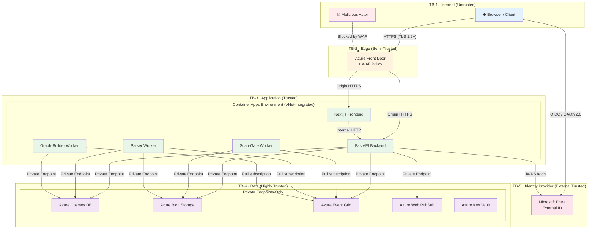
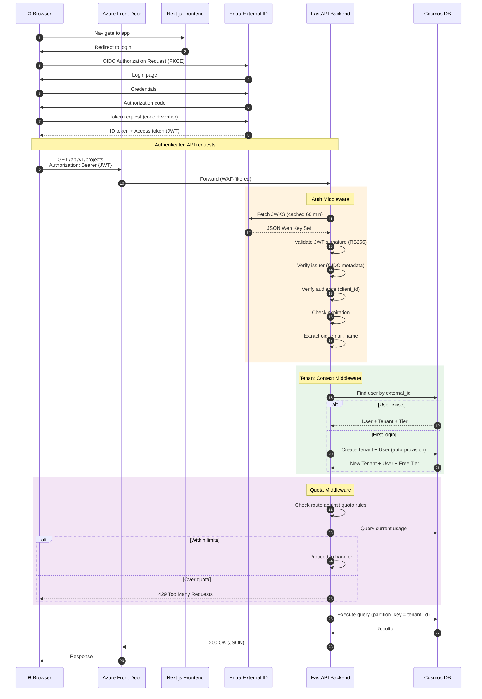
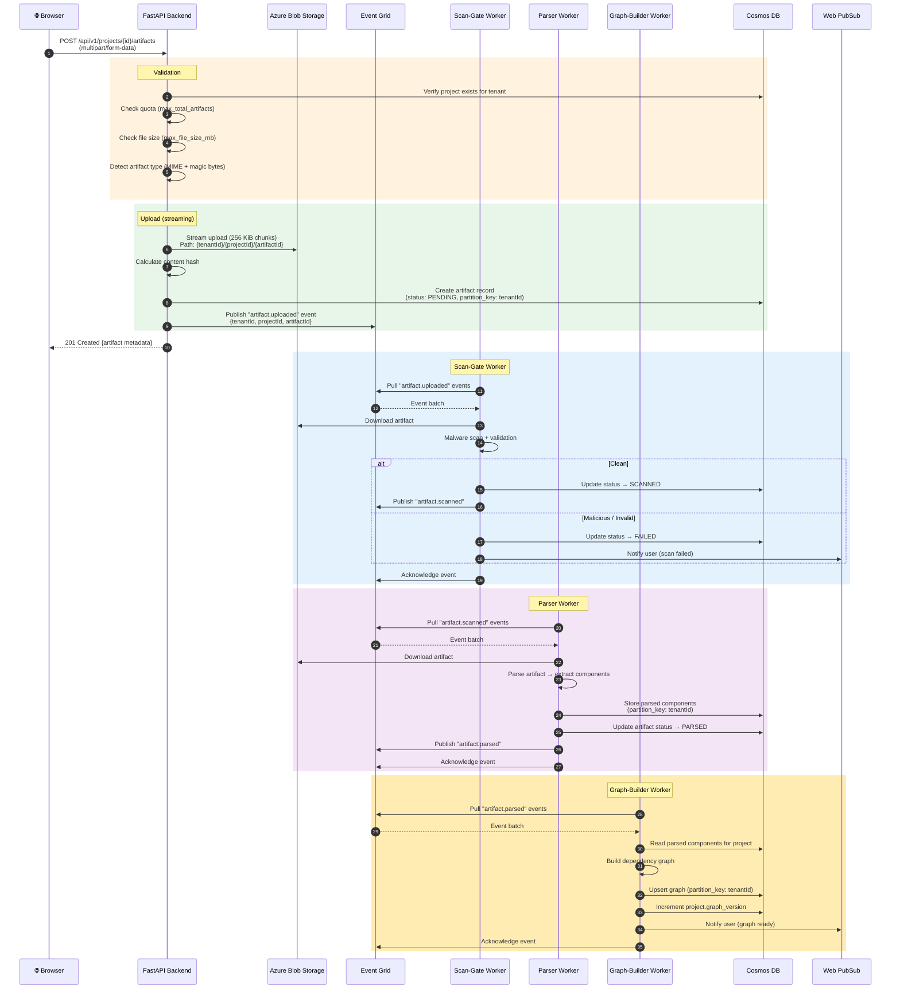
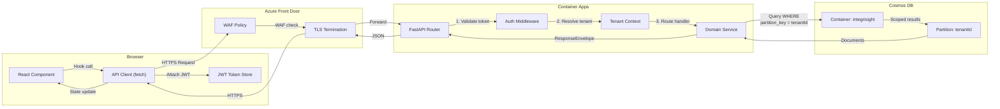

# 🛡️ STRIDE Threat Model — Integrisight.ai

> **Last Updated:** 2026-04-06
> **Status:** Living document · Revision 1.0
> **Audience:** Security engineers · Platform engineers · Architects
> **Companion:** [Security Analysis (2026-04-03)](./security-analysis-2026-04-03.md)

---

## Table of Contents

- [1. System Overview \& Trust Boundaries](#1-system-overview--trust-boundaries)
- [2. Data Flow Diagrams](#2-data-flow-diagrams)
- [3. STRIDE Analysis per Component](#3-stride-analysis-per-component)
- [4. Abuse Cases — Tenant Isolation](#4-abuse-cases--tenant-isolation)
- [5. Abuse Cases — Artifact Pipeline](#5-abuse-cases--artifact-pipeline)
- [6. Mitigations Matrix](#6-mitigations-matrix)
- [Appendix A — Glossary](#appendix-a--glossary)
- [Appendix B — References](#appendix-b--references)

---

## 1. System Overview & Trust Boundaries

### 1.1 Architecture Summary

Integrisight.ai is a **multi-tenant SaaS platform** hosted on Microsoft Azure. It allows Azure Integration Services developers to upload artifacts (Logic App definitions, API Management policies, Service Bus configurations, etc.), parse them into a dependency graph, and run AI-powered analysis.

| Layer | Technology | Hosting |
|---|---|---|
| 🌐 Frontend | Next.js 16 (TypeScript) | Azure Container Apps |
| ⚙️ Backend API | Python 3.13 / FastAPI | Azure Container Apps |
| 🔄 Workers | Python async workers (scan-gate, parser, graph-builder) | Azure Container Apps |
| 🗄️ Database | Azure Cosmos DB (NoSQL, serverless) | PaaS + Private Endpoint |
| 📦 Object Storage | Azure Blob Storage | PaaS + Private Endpoint |
| 📨 Eventing | Azure Event Grid Namespace (pull delivery) | PaaS + Private Endpoint |
| 🔐 Identity | Microsoft Entra External ID (CIAM) | SaaS |
| 🚪 Ingress | Azure Front Door Premium + WAF | Global edge |
| 🔔 Real-time | Azure Web PubSub | PaaS + Private Endpoint |
| 🔍 Observability | Application Insights + Log Analytics | PaaS |

### 1.2 Trust Boundaries

The system defines **four trust boundaries** that separate zones of differing trust levels:



### 1.3 Trust Boundary Definitions

| ID | Boundary | From → To | Controls |
|---|---|---|---|
| **TB-1→TB-2** | Internet → Edge | Untrusted clients → Azure Front Door | WAF rules, DDoS protection, TLS termination, geo-filtering |
| **TB-2→TB-3** | Edge → Application | Front Door → Container Apps | Origin authentication, VNet integration, managed certs |
| **TB-3→TB-4** | Application → Data | Container Apps → PaaS services | Managed identities, private endpoints, RBAC, no public access |
| **TB-1→TB-5** | Internet → Identity | Browser → Entra External ID | OIDC standard flow, PKCE, consent screens |
| **TB-5→TB-3** | Identity → Application | JWT validation in auth middleware | RS256 signature, issuer validation, audience check, expiry |

### 1.4 Tenant Boundary (Logical)

Within the application layer, a **logical tenant boundary** isolates each customer's data:

- **Cosmos DB:** Partition key = `{tenantId}` — all queries are scoped by partition key
- **Blob Storage:** Container path = `{tenantId}/{projectId}/{artifactId}`
- **Event Grid:** Events carry `tenantId` in the event data payload
- **JWT claims:** `oid`/`sub` → user lookup → `tenant_id` resolution via middleware

### 1.5 Admin Boundary

| Principal | Access Scope | Mechanism |
|---|---|---|
| Platform operators | Azure control plane | Azure RBAC (Contributor/Owner on resource group) |
| Container Apps | Cosmos, Blob, Event Grid, Web PubSub | Managed Identity + scoped RBAC roles |
| CI/CD pipeline | Container Registry, Container Apps | Service Principal with federated credentials |
| Developers (local) | Development endpoints only | `SKIP_AUTH=true` (blocked in production) |

---

## 2. Data Flow Diagrams

### 2.1 User Authentication Flow



### 2.2 Artifact Upload & Processing Pipeline



### 2.3 Frontend → API → Cosmos Data Access



---

## 3. STRIDE Analysis per Component

### 3.1 API Gateway (FastAPI Backend)

| Threat Category | ID | Threat | Attack Scenario | Severity | Likelihood |
|---|---|---|---|---|---|
| **🎭 Spoofing** | S-API-1 | Token forgery | Attacker crafts a JWT with a valid structure but signed with a different key, attempting to bypass signature validation | 🔴 Critical | Low |
| | S-API-2 | Token replay | Attacker captures a valid JWT and replays it after the legitimate user's session should have ended | 🟠 High | Medium |
| | S-API-3 | Issuer confusion | Attacker obtains a valid JWT from a different Entra tenant/application and presents it to the API | 🔴 Critical | Low |
| | S-API-4 | Dev credential abuse | Attacker exploits `SKIP_AUTH=true` if accidentally enabled in production | 🔴 Critical | Very Low |
| **🔧 Tampering** | T-API-1 | Request body manipulation | Attacker modifies `tenant_id` or `project_id` fields in request body to target another tenant's resources | 🔴 Critical | Medium |
| | T-API-2 | Header injection | Attacker injects malicious headers (e.g., `X-Forwarded-For` spoofing) to bypass rate limiting or geo-restrictions | 🟡 Medium | Medium |
| | T-API-3 | Path traversal | Attacker manipulates URL path parameters (e.g., `../../other-tenant/`) to access resources outside their scope | 🔴 Critical | Medium |
| | T-API-4 | Content-Type mismatch | Attacker sends a request with mismatched Content-Type header to bypass input validation | 🟡 Medium | Low |
| **🚫 Repudiation** | R-API-1 | Missing audit trail | Actions performed by authenticated users (CRUD operations) lack sufficient logging for forensic analysis | 🟡 Medium | High |
| | R-API-2 | Log injection | Attacker injects malicious content into log entries via user-controlled fields (email, display_name) | 🟡 Medium | Medium |
| | R-API-3 | Timestamp manipulation | Attacker manipulates client-side timestamps to create inconsistent audit records | 🟢 Low | Low |
| **🔍 Info Disclosure** | I-API-1 | Error message leaks | Unhandled exceptions expose stack traces, internal paths, or database details in error responses | 🟠 High | Medium |
| | I-API-2 | Enumeration via timing | Timing differences in auth/tenant resolution reveal whether a user or tenant exists | 🟡 Medium | Medium |
| | I-API-3 | OpenAPI spec exposure | `/docs`, `/redoc`, `/openapi.json` endpoints expose full API surface in production | 🟡 Medium | High |
| | I-API-4 | Response header leaks | Server version, framework details, or internal IPs leak in response headers | 🟢 Low | Medium |
| **💥 Denial of Service** | D-API-1 | Rate limit bypass | Attacker distributes requests across multiple IPs to bypass per-client rate limiting | 🟠 High | Medium |
| | D-API-2 | Large payload abuse | Attacker sends extremely large request bodies to exhaust memory or processing time | 🟠 High | Medium |
| | D-API-3 | Slowloris attack | Attacker opens many connections with slow, partial requests to exhaust connection pool | 🟡 Medium | Medium |
| | D-API-4 | Auth endpoint abuse | Attacker floods JWKS/OIDC discovery endpoints causing upstream rate limiting from Entra | 🟡 Medium | Low |
| **👑 Elevation of Privilege** | E-API-1 | Cross-tenant access | Attacker manipulates their request to access or modify another tenant's data | 🔴 Critical | Medium |
| | E-API-2 | Tier bypass | Attacker bypasses quota middleware to access features restricted to higher tiers | 🟠 High | Low |
| | E-API-3 | Role escalation | Attacker modifies their role from member to owner/admin within a tenant | 🟠 High | Low |
| | E-API-4 | Admin API access | Attacker discovers and accesses internal/administrative endpoints not intended for customers | 🔴 Critical | Low |

### 3.2 Artifact Processing Pipeline

| Threat Category | ID | Threat | Attack Scenario | Severity | Likelihood |
|---|---|---|---|---|---|
| **🎭 Spoofing** | S-ART-1 | Forged Event Grid events | Attacker publishes fake "artifact.uploaded" events to trigger processing of non-existent or malicious artifacts | 🔴 Critical | Very Low |
| | S-ART-2 | Worker identity spoofing | Compromised worker impersonates another worker to access resources outside its scope | 🟠 High | Very Low |
| **🔧 Tampering** | T-ART-1 | Blob manipulation post-upload | Attacker (or compromised component) modifies artifact content in Blob Storage between upload and processing | 🔴 Critical | Low |
| | T-ART-2 | Event data tampering | Event Grid event payload is modified to change `tenantId` or `projectId`, causing cross-tenant processing | 🔴 Critical | Very Low |
| | T-ART-3 | Content hash collision | Attacker crafts an artifact with the same content hash as a legitimate one to bypass deduplication | 🟡 Medium | Very Low |
| **🚫 Repudiation** | R-ART-1 | Untracked processing | Worker processes an artifact but fails to log the operation, making it impossible to audit what was processed | 🟡 Medium | Medium |
| | R-ART-2 | Silent failure | Worker encounters an error but fails silently without updating artifact status, leaving it in limbo | 🟡 Medium | Medium |
| **🔍 Info Disclosure** | I-ART-1 | Cross-tenant data leak | Parser or graph builder reads artifacts/data from wrong tenant partition due to incorrect tenant context | 🔴 Critical | Low |
| | I-ART-2 | Blob URL enumeration | Attacker guesses or enumerates blob URLs to download another tenant's artifacts | 🔴 Critical | Low |
| | I-ART-3 | Error messages in events | Failed processing events leak artifact content or internal details in error descriptions | 🟡 Medium | Medium |
| **💥 Denial of Service** | D-ART-1 | Zip bomb | Attacker uploads a compressed file that expands to enormous size during parsing, causing OOM | 🔴 Critical | Medium |
| | D-ART-2 | XML bomb (billion laughs) | Attacker uploads an XML artifact with recursive entity expansion to exhaust memory | 🔴 Critical | Medium |
| | D-ART-3 | Deeply nested JSON | Attacker uploads JSON with extreme nesting depth to cause stack overflow during parsing | 🟠 High | Medium |
| | D-ART-4 | Event flood | Attacker triggers rapid artifact uploads to overwhelm worker processing capacity | 🟠 High | Medium |
| | D-ART-5 | Poison message | Malformed artifact repeatedly fails processing and re-enters the queue, blocking other work | 🟠 High | Medium |
| **👑 Elevation of Privilege** | E-ART-1 | Wrong-tenant processing | Worker bug causes artifacts to be processed under the wrong tenant context, writing data to another tenant's partition | 🔴 Critical | Low |
| | E-ART-2 | Parser code execution | Malicious artifact content triggers code execution in the parser (e.g., YAML deserialization, template injection) | 🔴 Critical | Low |
| | E-ART-3 | Graph injection | Crafted artifact content manipulates the graph builder to create edges/nodes in another tenant's graph | 🔴 Critical | Low |

### 3.3 Cosmos DB (Data Layer)

| Threat Category | ID | Threat | Attack Scenario | Severity | Likelihood |
|---|---|---|---|---|---|
| **🎭 Spoofing** | S-DB-1 | Managed identity impersonation | Attacker obtains managed identity token to directly access Cosmos DB bypassing application logic | 🔴 Critical | Very Low |
| **🔧 Tampering** | T-DB-1 | Direct access bypass | Attacker with leaked connection string or managed identity token modifies data directly in Cosmos, bypassing application validation | 🔴 Critical | Very Low |
| | T-DB-2 | ETag race condition | Attacker exploits time-of-check-to-time-of-use gap in optimistic concurrency to overwrite data | 🟡 Medium | Low |
| | T-DB-3 | Stored procedure manipulation | Attacker modifies stored procedures to alter query behavior or exfiltrate data | 🔴 Critical | Very Low |
| **🚫 Repudiation** | R-DB-1 | Unaudited direct writes | Direct SDK writes without corresponding application-level audit logs create untracked changes | 🟡 Medium | Medium |
| **🔍 Info Disclosure** | I-DB-1 | Cross-partition query | Application bug or injection allows a query that reads data across partition boundaries (tenant leak) | 🔴 Critical | Low |
| | I-DB-2 | Diagnostic data exposure | Cosmos DB diagnostic settings or query metrics expose tenant data patterns or document contents | 🟡 Medium | Low |
| | I-DB-3 | Backup data exposure | Cosmos DB automatic backups contain multi-tenant data; backup access reveals all tenants' data | 🟠 High | Very Low |
| **💥 Denial of Service** | D-DB-1 | RU exhaustion | Noisy-neighbor: one tenant's heavy queries consume all Request Units, starving other tenants | 🟠 High | Medium |
| | D-DB-2 | Hot partition | High-volume writes to a single partition key overwhelm that partition's throughput | 🟡 Medium | Medium |
| **👑 Elevation of Privilege** | E-DB-1 | Partition key manipulation | Application-level bug allows attacker to set `partition_key` to another tenant's ID when creating/updating documents | 🔴 Critical | Low |
| | E-DB-2 | Role over-assignment | Cosmos RBAC role grants broader permissions than required (e.g., account-level vs. container-level) | 🟠 High | Low |

### 3.4 Frontend (Next.js)

| Threat Category | ID | Threat | Attack Scenario | Severity | Likelihood |
|---|---|---|---|---|---|
| **🎭 Spoofing** | S-FE-1 | Session hijacking | Attacker steals JWT from browser storage (XSS, browser extension, shared computer) to impersonate user | 🔴 Critical | Medium |
| | S-FE-2 | Phishing via open redirect | Attacker crafts a URL that redirects through the app to a phishing page after authentication | 🟠 High | Medium |
| **🔧 Tampering** | T-FE-1 | CSP bypass | Attacker finds a way to bypass Content Security Policy to inject malicious scripts | 🟠 High | Low |
| | T-FE-2 | DOM manipulation | Attacker manipulates the DOM via browser devtools or extensions to alter application behavior | 🟢 Low | High |
| | T-FE-3 | Client-side validation bypass | Attacker bypasses frontend validation (file size, type) to upload invalid artifacts | 🟡 Medium | High |
| **🚫 Repudiation** | R-FE-1 | Client-side action logging | No client-side audit trail for user actions (clicks, navigation, downloads) | 🟢 Low | High |
| **🔍 Info Disclosure** | I-FE-1 | Local/session storage leaks | JWT or sensitive data stored in localStorage/sessionStorage accessible to XSS or browser extensions | 🟠 High | Medium |
| | I-FE-2 | Source map exposure | Production source maps expose application logic, API endpoints, and internal structure | 🟡 Medium | Medium |
| | I-FE-3 | Browser history leaks | Sensitive data in URL parameters (tenant IDs, project IDs) visible in browser history | 🟢 Low | High |
| **💥 Denial of Service** | D-FE-1 | Client-side resource exhaustion | Attacker triggers expensive client-side operations (large graph rendering) to freeze browser | 🟢 Low | Medium |
| **👑 Elevation of Privilege** | E-FE-1 | Frontend route bypass | Attacker navigates directly to admin or restricted routes by manipulating client-side routing | 🟡 Medium | High |
| | E-FE-2 | API call manipulation | Attacker modifies API calls from browser devtools to access unauthorized endpoints or data | 🟠 High | High |

---

## 4. Abuse Cases — Tenant Isolation

### AC-TI-1: Tenant A Reads/Modifies Tenant B's Data via API Path Manipulation

```
┌─────────────────────────────────────────────────────────────────────┐
│ ABUSE CASE: Cross-Tenant Data Access via Path Manipulation         │
├─────────────────────────────────────────────────────────────────────┤
│ Attacker: Authenticated user of Tenant A                           │
│ Goal:     Access or modify Tenant B's projects/artifacts           │
│ Precondition: Valid JWT for Tenant A                               │
└─────────────────────────────────────────────────────────────────────┘
```

**Attack Vectors:**

| # | Vector | Example Request | Expected Behavior |
|---|---|---|---|
| 1 | Direct ID substitution | `GET /api/v1/projects/{tenantB-projectId}` | 404 — query scoped by `partition_key = tenantA` |
| 2 | Body field injection | `POST /api/v1/projects` with `{"tenant_id": "tenantB"}` | Ignored — `tenant_id` sourced from middleware, not request body |
| 3 | Query parameter injection | `GET /api/v1/projects?tenant_id=tenantB` | Ignored — query parameter not used for tenant scoping |
| 4 | Path traversal | `GET /api/v1/projects/../../../tenantB/projects` | Rejected by FastAPI path parsing; 404 or 422 |

**Current Mitigations:**
- ✅ Tenant ID always derived from JWT → user lookup → tenant association (never from client input)
- ✅ All Cosmos queries include `partition_key = tenant_id` (from `request.state.tenant.id`)
- ✅ Project/artifact lookups additionally check `tenant_id` field matches
- ✅ FastAPI's path parameter validation prevents traversal

**Residual Risk:** 🟢 Low — Defense-in-depth with middleware-enforced tenant scoping.

---

### AC-TI-2: Tenant A Accesses Tenant B's Artifacts via Blob URL Guessing

```
┌─────────────────────────────────────────────────────────────────────┐
│ ABUSE CASE: Blob Storage Artifact Enumeration                      │
├─────────────────────────────────────────────────────────────────────┤
│ Attacker: Authenticated user of Tenant A (or anonymous)            │
│ Goal:     Download Tenant B's uploaded artifacts                   │
│ Precondition: Knowledge of blob naming convention                  │
└─────────────────────────────────────────────────────────────────────┘
```

**Attack Vectors:**

| # | Vector | Path Pattern | Expected Behavior |
|---|---|---|---|
| 1 | Direct blob URL access | `https://{storage}.blob.core.windows.net/{container}/{tenantB}/{projectId}/{artifactId}` | Blocked — private endpoint, no public access |
| 2 | SAS token guessing | Brute-force or predictable SAS tokens | Blocked — no SAS tokens issued; managed identity only |
| 3 | API download for wrong tenant | `GET /api/v1/projects/{tenantB-proj}/artifacts/{id}/download` | 404 — project lookup scoped to caller's tenant |
| 4 | Container listing | Enumerate blob containers to discover tenant data | Blocked — no public listing; RBAC restricts to managed identity |

**Current Mitigations:**
- ✅ Blob Storage accessible only via private endpoints (no public access)
- ✅ All blob operations use managed identity RBAC (Storage Blob Data Contributor)
- ✅ API download endpoint validates project ownership before generating blob download
- ✅ No SAS tokens generated — all access mediated by the API

**Residual Risk:** 🟢 Low — No direct path to blob storage from internet.

---

### AC-TI-3: Tenant A Triggers Processing of Tenant B's Artifacts via Event Grid

```
┌─────────────────────────────────────────────────────────────────────┐
│ ABUSE CASE: Event Grid Cross-Tenant Event Injection                │
├─────────────────────────────────────────────────────────────────────┤
│ Attacker: Authenticated user of Tenant A                           │
│ Goal:     Trigger re-processing or manipulation of Tenant B's data │
│ Precondition: Knowledge of Event Grid topic structure              │
└─────────────────────────────────────────────────────────────────────┘
```

**Attack Vectors:**

| # | Vector | Description | Expected Behavior |
|---|---|---|---|
| 1 | Direct event publish | Publish events to Event Grid with Tenant B's IDs | Blocked — Event Grid behind private endpoint; only managed identity can publish |
| 2 | API-triggered events with spoofed IDs | Upload artifact but inject Tenant B's IDs in metadata | Event payload constructed server-side using `request.state.tenant.id` |
| 3 | Event replay | Capture and replay legitimate events | Events consumed via pull delivery with acknowledgment; replayed events may be reprocessed |

**Current Mitigations:**
- ✅ Event Grid Namespace accessible only via private endpoints
- ✅ Event publishing uses managed identity (EventGrid Data Sender role)
- ✅ Event payloads constructed server-side from validated tenant context
- ⚠️ **Partial:** Workers should validate that the `tenantId` in event data matches the artifact's actual tenant in Cosmos

**Residual Risk:** 🟡 Medium — Event replay is possible if events are not idempotent.

---

### AC-TI-4: Worker Writes Graph Data to Wrong Tenant Partition

```
┌─────────────────────────────────────────────────────────────────────┐
│ ABUSE CASE: Cross-Tenant Graph Pollution                           │
├─────────────────────────────────────────────────────────────────────┤
│ Attacker: Indirect (via bug or crafted artifact)                   │
│ Goal:     Corrupt Tenant B's dependency graph                      │
│ Precondition: Bug in worker tenant context handling                │
└─────────────────────────────────────────────────────────────────────┘
```

**Attack Scenario:**

1. Attacker (Tenant A) uploads an artifact containing references that resemble Tenant B's project IDs
2. Parser worker extracts component references including the crafted IDs
3. Graph builder worker uses the extracted IDs without re-validating tenant ownership
4. Graph edges are created pointing to or from Tenant B's partition

**Current Mitigations:**
- ✅ Workers derive `tenantId` from event payload (set server-side at upload time)
- ✅ All Cosmos writes use `partition_key = tenantId` from event data
- ⚠️ **Partial:** Graph builder should validate that all referenced components belong to the same tenant before creating edges

**Residual Risk:** 🟡 Medium — Requires a bug in worker logic; no intentional cross-partition write path exists.

---

### AC-TI-5: JWT Claim Manipulation for Tenant Impersonation

```
┌─────────────────────────────────────────────────────────────────────┐
│ ABUSE CASE: Tenant Impersonation via Token Manipulation            │
├─────────────────────────────────────────────────────────────────────┤
│ Attacker: External malicious actor                                 │
│ Goal:     Obtain a JWT that resolves to Tenant B's context         │
│ Precondition: Access to a valid token or Entra tenant              │
└─────────────────────────────────────────────────────────────────────┘
```

**Attack Vectors:**

| # | Vector | Description | Expected Behavior |
|---|---|---|---|
| 1 | Modify `oid`/`sub` claim | Alter the JWT's `oid` or `sub` to match Tenant B's owner | Rejected — JWT signature validation fails (RS256) |
| 2 | Use token from different Entra tenant | Present a valid JWT from a different Entra External ID instance | Rejected — issuer validation against OIDC discovery metadata |
| 3 | Use token from different application | Present a valid JWT from same Entra tenant but different app registration | Rejected — audience (`aud`) claim validation against `entra_ciam_client_id` |
| 4 | Expired token replay | Present a previously valid but now expired token | Rejected — expiration (`exp`) claim validation |
| 5 | Algorithm confusion (none/HS256) | Present a token with `alg: none` or symmetric key | Rejected — library enforces RS256 with specific JWKS keys |

**Current Mitigations:**
- ✅ RS256 signature validation with JWKS from Entra OIDC discovery
- ✅ Issuer validated from OIDC metadata (not hardcoded)
- ✅ Audience validated against configured `entra_ciam_client_id`
- ✅ Expiration enforced by JWT library
- ✅ JWKS cached with 60-minute TTL and auto-refresh on KID miss
- ✅ Production guard prevents `SKIP_AUTH=true`

**Residual Risk:** 🟢 Low — Standard OIDC/JWT validation with defense-in-depth.

---

## 5. Abuse Cases — Artifact Pipeline

### AC-AP-1: Malicious File Crashes Parser

```
┌─────────────────────────────────────────────────────────────────────┐
│ ABUSE CASE: Parser Denial-of-Service via Malicious Artifacts       │
├─────────────────────────────────────────────────────────────────────┤
│ Attacker: Authenticated user (any tier)                            │
│ Goal:     Crash or hang worker processes to disrupt service        │
│ Precondition: Ability to upload artifacts                          │
└─────────────────────────────────────────────────────────────────────┘
```

**Attack Variants:**

| # | Variant | Payload | Impact |
|---|---|---|---|
| 1 | **Zip bomb** | Compressed file (e.g., 42.zip) that expands to petabytes | Worker OOM → crash → restart loop |
| 2 | **XML bomb (Billion Laughs)** | XML with recursive entity definitions (`<!ENTITY a "&b;&b;">`) | Parser memory exhaustion → OOM kill |
| 3 | **Deeply nested JSON** | JSON with 10,000+ nesting levels (`{{{...}}}`) | Stack overflow in recursive parser |
| 4 | **Massive single-line file** | Multi-GB single line of valid JSON/XML | Memory exhaustion when reading line-by-line |
| 5 | **Polyglot file** | File that passes MIME detection as valid but contains exploit | Parser-dependent behavior; potential code execution |

**Current Mitigations:**
- ✅ File size limit enforced at upload time (`max_file_size_mb` per tier, default 10 MB)
- ✅ Streaming upload with 256 KiB chunks (not buffered in API memory)
- ✅ MIME type detection with magic bytes validation
- ⚠️ **Partial:** No decompression bomb detection in scan-gate worker
- ⚠️ **Partial:** No XML entity expansion limits configured
- ⚠️ **Partial:** No JSON nesting depth limits configured

**Recommended Controls:**
1. Configure XML parser with `defusedxml` to disable entity expansion
2. Set JSON parsing depth limit (e.g., 100 levels)
3. Implement decompression ratio check (abort if ratio > 100:1)
4. Set per-worker memory limits in Container Apps configuration
5. Implement processing timeout per artifact (e.g., 60 seconds)

**Residual Risk:** 🟠 High — File size limits help but do not prevent expansion-based attacks.

---

### AC-AP-2: Chunked Transfer Encoding Bypass for Size Limits

```
┌─────────────────────────────────────────────────────────────────────┐
│ ABUSE CASE: File Size Limit Bypass                                 │
├─────────────────────────────────────────────────────────────────────┤
│ Attacker: Authenticated user                                       │
│ Goal:     Upload artifacts exceeding the tier's file size limit    │
│ Precondition: Knowledge of HTTP chunked transfer encoding          │
└─────────────────────────────────────────────────────────────────────┘
```

**Attack Scenario:**

1. Attacker sends `Transfer-Encoding: chunked` without `Content-Length` header
2. File size check based on `Content-Length` header is bypassed
3. Streaming upload proceeds without knowing total file size upfront
4. Large file is fully uploaded before size can be validated

**Current Mitigations:**
- ✅ Streaming upload tracks bytes read during upload (256 KiB chunks)
- ✅ Front Door WAF can enforce maximum request body size
- ⚠️ **Partial:** Backend should abort upload mid-stream if accumulated bytes exceed limit

**Recommended Controls:**
1. Track cumulative bytes during streaming upload and abort when limit exceeded
2. Configure Front Door WAF `maxRequestBodySizeInKb` rule
3. Set Container Apps ingress `maxRequestBodySize` configuration

**Residual Risk:** 🟡 Medium — Streaming architecture helps; explicit byte counting during upload would close the gap.

---

### AC-AP-3: Race Condition — Upload + Delete Project Simultaneously

```
┌─────────────────────────────────────────────────────────────────────┐
│ ABUSE CASE: TOCTOU Race in Artifact Upload                         │
├─────────────────────────────────────────────────────────────────────┤
│ Attacker: Authenticated user                                       │
│ Goal:     Create orphaned artifacts or bypass validation           │
│ Precondition: Two concurrent sessions                              │
└─────────────────────────────────────────────────────────────────────┘
```

**Attack Scenario:**

```
Time    Session 1 (Upload)              Session 2 (Delete)
────    ──────────────────              ──────────────────
T1      POST /artifacts                 
T2      → Validate project exists ✓     
T3                                      DELETE /projects/{id}
T4                                      → Project status → DELETED ✓
T5      → Upload blob ✓                 
T6      → Create artifact record ✓      
T7      → Publish event ✓               
T8      Orphaned artifact exists         Workers process for deleted project
```

**Current Mitigations:**
- ✅ Optimistic concurrency via ETags prevents conflicting writes to the same document
- ✅ Project soft-delete (status = DELETED) rather than hard delete
- ⚠️ **Partial:** No transactional guarantee between project check and artifact creation

**Recommended Controls:**
1. Workers should check project status before processing artifacts
2. Add a cleanup job that removes artifacts for deleted projects
3. Consider using Cosmos DB transactional batch for project-scoped operations

**Residual Risk:** 🟡 Medium — Orphaned artifacts waste storage but don't breach security boundaries.

---

### AC-AP-4: Artifact Content Injection to Manipulate Graph Builder

```
┌─────────────────────────────────────────────────────────────────────┐
│ ABUSE CASE: Graph Injection via Crafted Artifact Content           │
├─────────────────────────────────────────────────────────────────────┤
│ Attacker: Authenticated user                                       │
│ Goal:     Manipulate dependency graph to show false dependencies   │
│ Precondition: Knowledge of graph builder's parsing logic           │
└─────────────────────────────────────────────────────────────────────┘
```

**Attack Scenario:**

1. Attacker crafts an artifact (e.g., a Logic App definition) with references to components that don't exist or reference external systems
2. Parser extracts these references as legitimate component dependencies
3. Graph builder creates edges to non-existent or misleading nodes
4. The resulting dependency graph is inaccurate, potentially misleading analysis

**Current Mitigations:**
- ✅ Graph components and edges are scoped to tenant's partition
- ⚠️ **Partial:** Parser does not validate that referenced components actually exist
- ⚠️ **Partial:** Graph builder does not cross-reference components against known resources

**Recommended Controls:**
1. Validate extracted references against known components in the project
2. Flag unresolved references as "external" or "unverified" in the graph
3. Rate-limit graph complexity (max nodes/edges per project)

**Residual Risk:** 🟡 Medium — Impacts data quality within attacker's own tenant; no cross-tenant impact.

---

### AC-AP-5: Event Replay Attack — Re-process Already-Processed Artifacts

```
┌─────────────────────────────────────────────────────────────────────┐
│ ABUSE CASE: Event Replay for Duplicate Processing                  │
├─────────────────────────────────────────────────────────────────────┤
│ Attacker: Insider or compromised component                         │
│ Goal:     Trigger re-processing to corrupt state or waste resources│
│ Precondition: Access to Event Grid topic or cached events          │
└─────────────────────────────────────────────────────────────────────┘
```

**Attack Scenario:**

1. Attacker (or buggy component) re-publishes a previously acknowledged event
2. Worker picks up the event and re-processes the artifact
3. If processing is not idempotent, the graph is duplicated or corrupted
4. Resources (compute, RU) are wasted on redundant processing

**Current Mitigations:**
- ✅ Event Grid pull delivery with explicit acknowledgment (consumed events are removed)
- ✅ Event Grid Namespace uses managed identity authentication (limits who can publish)
- ⚠️ **Partial:** Workers should check artifact status before reprocessing (idempotency)

**Recommended Controls:**
1. Implement idempotency checks: skip processing if artifact status ≥ current event stage
2. Add event deduplication using `event_id` tracking in Cosmos
3. Set up dead-letter queue for events that fail multiple times
4. Monitor for anomalous event volume per tenant

**Residual Risk:** 🟡 Medium — Pull delivery model reduces risk; idempotency checks would eliminate it.

---

## 6. Mitigations Matrix

### 6.1 API Gateway Mitigations

| Threat ID | Threat | Status | Current Control | Residual Risk | Recommended Action |
|---|---|---|---|---|---|
| S-API-1 | Token forgery | ✅ Implemented | RS256 signature validation via JWKS | 🟢 Low | Maintain JWKS rotation schedule |
| S-API-2 | Token replay | ✅ Implemented | JWT expiration enforcement | 🟢 Low | Consider short-lived tokens (5-15 min) with refresh tokens |
| S-API-3 | Issuer confusion | ✅ Implemented | Issuer validated from OIDC discovery metadata | 🟢 Low | None — robust implementation |
| S-API-4 | Dev credential abuse | ✅ Implemented | `RuntimeError` guard if `SKIP_AUTH=true` in production | 🟢 Low | Add CI check for env variable configs |
| T-API-1 | Body field injection | ✅ Implemented | `tenant_id` sourced from middleware, not request body | 🟢 Low | None — server-side derivation |
| T-API-2 | Header injection | ⚠️ Partial | Front Door strips/normalizes some headers | 🟡 Medium | Validate `X-Forwarded-*` headers from trusted proxy only |
| T-API-3 | Path traversal | ✅ Implemented | FastAPI path parameter validation | 🟢 Low | None — framework handles this |
| T-API-4 | Content-Type mismatch | ✅ Implemented | FastAPI enforces expected Content-Type per route | 🟢 Low | None — framework handles this |
| R-API-1 | Missing audit trail | ⚠️ Partial | Structured logging with `request_id` and `tenant_id` | 🟡 Medium | Add dedicated audit log for CRUD operations with before/after state |
| R-API-2 | Log injection | ⚠️ Partial | Structured logging (structlog) with key-value pairs | 🟢 Low | Sanitize user-controlled fields in log entries |
| R-API-3 | Timestamp manipulation | ✅ Implemented | Server-side timestamps for all records (`created_at`, `updated_at`) | 🟢 Low | None — client timestamps not trusted |
| I-API-1 | Error message leaks | ✅ Implemented | `AppError` handler returns structured `ErrorResponse`; generic 500 for unhandled | 🟢 Low | Periodic review of exception handlers |
| I-API-2 | Enumeration via timing | ❌ None | No constant-time responses | 🟡 Medium | Add artificial delay jitter to auth failures |
| I-API-3 | OpenAPI spec exposure | ⚠️ Partial | Endpoints exist but may not be referenced externally | 🟡 Medium | Disable `/docs`, `/redoc`, `/openapi.json` in production |
| I-API-4 | Response header leaks | ⚠️ Partial | Front Door may strip some headers | 🟢 Low | Add `Server` header removal; review `X-Powered-By` |
| D-API-1 | Rate limit bypass | ⚠️ Partial | Quota middleware enforces per-tenant limits | 🟡 Medium | Add Front Door rate limiting per IP/session |
| D-API-2 | Large payload abuse | ✅ Implemented | Streaming upload with tier-based size limits | 🟢 Low | Configure Front Door `maxRequestBodySize` |
| D-API-3 | Slowloris attack | ⚠️ Partial | Front Door provides connection timeout defaults | 🟡 Medium | Configure explicit request timeouts in Container Apps |
| D-API-4 | Auth endpoint abuse | ✅ Implemented | JWKS cached with 60-minute TTL | 🟢 Low | None — caching limits upstream calls |
| E-API-1 | Cross-tenant access | ✅ Implemented | Middleware-enforced tenant scoping on all queries | 🟢 Low | Add integration tests for cross-tenant isolation |
| E-API-2 | Tier bypass | ✅ Implemented | Quota middleware with pattern-based route matching | 🟢 Low | None — server-side enforcement |
| E-API-3 | Role escalation | ⚠️ Partial | Single OWNER role; no role update endpoint | 🟢 Low | Implement explicit role checks when multi-role is added |
| E-API-4 | Admin API access | ✅ Implemented | No admin endpoints exposed; health endpoints skipped | 🟢 Low | Audit new endpoints for proper auth requirements |

### 6.2 Artifact Pipeline Mitigations

| Threat ID | Threat | Status | Current Control | Residual Risk | Recommended Action |
|---|---|---|---|---|---|
| S-ART-1 | Forged events | ✅ Implemented | Private endpoint + managed identity for Event Grid | 🟢 Low | None — no external publish path |
| S-ART-2 | Worker identity spoofing | ✅ Implemented | Managed identity per worker; RBAC scoped roles | 🟢 Low | None — platform-managed identities |
| T-ART-1 | Blob manipulation post-upload | ⚠️ Partial | Private endpoint; managed identity access | 🟡 Medium | Enable blob versioning; verify content hash before processing |
| T-ART-2 | Event data tampering | ✅ Implemented | Events constructed server-side; private endpoint | 🟢 Low | None — no external publish path |
| T-ART-3 | Content hash collision | ✅ Implemented | SHA-256 content hash (collision-resistant) | 🟢 Low | None — cryptographic hash |
| R-ART-1 | Untracked processing | ⚠️ Partial | Worker base class includes logging | 🟡 Medium | Add structured audit events for each processing stage |
| R-ART-2 | Silent failure | ⚠️ Partial | Dead-letter utilities exist in worker shared code | 🟡 Medium | Ensure all error paths update artifact status to FAILED |
| I-ART-1 | Cross-tenant data leak | ✅ Implemented | Partition key scoping in all Cosmos queries | 🟢 Low | Add worker-level tenant context validation |
| I-ART-2 | Blob URL enumeration | ✅ Implemented | Private endpoint; no public access; no SAS tokens | 🟢 Low | None — no internet-accessible blob URLs |
| I-ART-3 | Error messages in events | ⚠️ Partial | Error handling exists but leak potential not audited | 🟡 Medium | Review error event payloads for data leakage |
| D-ART-1 | Zip bomb | ❌ None | No decompression ratio check | 🟠 High | Implement decompression ratio limit (100:1) |
| D-ART-2 | XML bomb | ❌ None | No XML entity expansion limits | 🟠 High | Use `defusedxml`; disable external entities |
| D-ART-3 | Deeply nested JSON | ❌ None | No nesting depth limit | 🟠 High | Set JSON parse depth limit (100 levels) |
| D-ART-4 | Event flood | ⚠️ Partial | Quota limits artifact creation rate indirectly | 🟡 Medium | Add per-tenant event rate limiting on workers |
| D-ART-5 | Poison message | ⚠️ Partial | Dead-letter utilities exist | 🟡 Medium | Implement max retry count with dead-letter after 3 failures |
| E-ART-1 | Wrong-tenant processing | ⚠️ Partial | Event carries `tenantId`; Cosmos scoped by partition key | 🟡 Medium | Workers must cross-validate event `tenantId` against artifact record |
| E-ART-2 | Parser code execution | ⚠️ Partial | MIME type detection filters known types | 🟡 Medium | Use safe deserialization; sandbox parser; no `eval`/`exec` |
| E-ART-3 | Graph injection | ⚠️ Partial | Graph scoped to tenant partition | 🟡 Medium | Validate all component references belong to same tenant |

### 6.3 Cosmos DB Mitigations

| Threat ID | Threat | Status | Current Control | Residual Risk | Recommended Action |
|---|---|---|---|---|---|
| S-DB-1 | Managed identity impersonation | ✅ Implemented | Platform-managed identity; no keys in code | 🟢 Low | Enable Azure Defender for Cosmos DB |
| T-DB-1 | Direct access bypass | ✅ Implemented | Private endpoint; managed identity RBAC | 🟢 Low | Disable key-based access; enforce AAD-only auth |
| T-DB-2 | ETag race condition | ✅ Implemented | Optimistic concurrency with ETags on all updates | 🟢 Low | None — standard pattern |
| T-DB-3 | Stored procedure manipulation | ⚠️ Partial | Stored procedures in source control | 🟡 Medium | Restrict stored procedure management to CI/CD pipeline identity |
| R-DB-1 | Unaudited direct writes | ⚠️ Partial | Application-level logging for repository operations | 🟡 Medium | Enable Cosmos DB diagnostic logging for all operations |
| I-DB-1 | Cross-partition query | ✅ Implemented | All queries include `partition_key` filter | 🟢 Low | Code review checklist: verify partition key in all new queries |
| I-DB-2 | Diagnostic data exposure | ⚠️ Partial | Diagnostics sent to Log Analytics (RBAC controlled) | 🟢 Low | Review diagnostic settings for data sensitivity |
| I-DB-3 | Backup data exposure | ⚠️ Partial | Platform-managed backups with RBAC | 🟡 Medium | Review backup retention policies; restrict restore permissions |
| D-DB-1 | RU exhaustion (noisy neighbor) | ⚠️ Partial | Serverless mode has per-partition throughput limits | 🟡 Medium | Monitor per-tenant RU consumption; alert on spikes |
| D-DB-2 | Hot partition | ⚠️ Partial | Partition key = `tenantId` distributes data | 🟡 Medium | Monitor partition heat maps; consider sub-partitioning for large tenants |
| E-DB-1 | Partition key manipulation | ✅ Implemented | Partition key set from middleware `tenant_id`, not user input | 🟢 Low | None — server-side derivation |
| E-DB-2 | Role over-assignment | ⚠️ Partial | RBAC roles assigned in Bicep templates | 🟡 Medium | Audit role assignments; enforce least privilege at container level |

### 6.4 Frontend Mitigations

| Threat ID | Threat | Status | Current Control | Residual Risk | Recommended Action |
|---|---|---|---|---|---|
| S-FE-1 | Session hijacking | ⚠️ Partial | CSP headers restrict script sources | 🟡 Medium | Use `httpOnly` cookies for tokens where possible; implement token binding |
| S-FE-2 | Phishing via open redirect | ⚠️ Partial | No explicit redirect validation | 🟡 Medium | Validate redirect URLs against allowlist |
| T-FE-1 | CSP bypass | ✅ Implemented | CSP headers configured in `next.config.ts` | 🟢 Low | Periodic CSP policy review; use CSP reporting |
| T-FE-2 | DOM manipulation | ✅ Implemented | React's virtual DOM prevents XSS; server-side validation | 🟢 Low | None — client-side manipulation doesn't bypass server checks |
| T-FE-3 | Client-side validation bypass | ✅ Implemented | All validation duplicated server-side (size, type, quota) | 🟢 Low | None — server is the authority |
| R-FE-1 | Client-side action logging | ❌ None | No client-side audit trail | 🟢 Low | Consider adding analytics for security-relevant actions |
| I-FE-1 | Local/session storage leaks | ⚠️ Partial | CSP limits script injection vectors | 🟡 Medium | Minimize sensitive data in browser storage; prefer session storage |
| I-FE-2 | Source map exposure | ⚠️ Partial | Production builds may include source maps | 🟡 Medium | Disable source maps in production builds |
| I-FE-3 | Browser history leaks | ✅ Implemented | UUIDs used for resource IDs (not sequential/guessable) | 🟢 Low | None — IDs are opaque |
| D-FE-1 | Client-side resource exhaustion | ⚠️ Partial | No explicit limits on graph rendering complexity | 🟢 Low | Add pagination/virtualization for large graphs |
| E-FE-1 | Frontend route bypass | ✅ Implemented | All authorization enforced server-side; frontend routes are cosmetic | 🟢 Low | None — server is the authority |
| E-FE-2 | API call manipulation | ✅ Implemented | All authorization enforced server-side via middleware chain | 🟢 Low | None — browser is an untrusted client |

---

### 6.5 Risk Summary Dashboard

| Risk Level | Count | Key Areas |
|---|---|---|
| 🟢 **Low** | 35 | JWT validation, tenant scoping, RBAC, private endpoints, framework protections |
| 🟡 **Medium** | 19 | Audit logging, header handling, rate limiting, worker validation, source maps |
| 🟠 **High** | 3 | Zip bombs, XML bombs, deeply nested JSON (parser DoS) |
| 🔴 **Critical** | 0 | — |

### 6.6 Priority Action Items

The following actions are ordered by impact and urgency:

| Priority | Action | Threats Addressed | Effort |
|---|---|---|---|
| 🔴 **P0** | Implement `defusedxml` for XML parsing; disable external entities | D-ART-2 | Small |
| 🔴 **P0** | Add JSON nesting depth limit (100 levels) in parser | D-ART-3 | Small |
| 🔴 **P0** | Add decompression ratio check (abort if > 100:1) | D-ART-1 | Medium |
| 🟠 **P1** | Workers cross-validate event `tenantId` against artifact record in Cosmos | E-ART-1, AC-TI-3, AC-TI-4 | Small |
| 🟠 **P1** | Implement idempotency checks in workers (skip if already processed) | AC-AP-5, D-ART-5 | Medium |
| 🟠 **P1** | Disable `/docs`, `/redoc`, `/openapi.json` in production | I-API-3 | Small |
| 🟡 **P2** | Add dedicated audit log for data mutations (create/update/delete) | R-API-1, R-ART-1 | Medium |
| 🟡 **P2** | Configure Front Door rate limiting per IP (complement per-tenant quota) | D-API-1 | Medium |
| 🟡 **P2** | Verify content hash before worker processing (detect post-upload tampering) | T-ART-1 | Small |
| 🟡 **P2** | Add processing timeout per artifact (60-second deadline) | D-ART-1, D-ART-2, D-ART-3 | Small |
| 🟡 **P2** | Disable source maps in production frontend builds | I-FE-2 | Small |
| 🟢 **P3** | Enable Cosmos DB diagnostic logging for all operations | R-DB-1 | Small |
| 🟢 **P3** | Review and tighten Cosmos RBAC to container-level scoping | E-DB-2 | Medium |
| 🟢 **P3** | Validate redirect URLs against allowlist in frontend | S-FE-2 | Small |

---

## Appendix A — Glossary

| Term | Definition |
|---|---|
| **STRIDE** | Spoofing, Tampering, Repudiation, Information Disclosure, Denial of Service, Elevation of Privilege — Microsoft's threat categorization framework |
| **CIAM** | Customer Identity and Access Management — Entra External ID for consumer/customer-facing authentication |
| **Partition Key** | Cosmos DB's logical data isolation mechanism; set to `tenantId` for tenant scoping |
| **Pull Delivery** | Event Grid consumption model where workers pull events on their schedule (vs. push webhooks) |
| **Managed Identity** | Azure AD identity automatically managed by the platform; eliminates credential management |
| **Private Endpoint** | Azure networking feature that exposes a PaaS service on a private IP within a VNet |
| **WAF** | Web Application Firewall — Azure Front Door Premium feature for OWASP rule enforcement |
| **TOCTOU** | Time-of-Check-to-Time-of-Use — race condition class where checked state changes before use |
| **ETag** | Entity tag for optimistic concurrency control in Cosmos DB |
| **PKCE** | Proof Key for Code Exchange — OAuth 2.0 extension preventing authorization code interception |

## Appendix B — References

| Resource | Link |
|---|---|
| Microsoft STRIDE Overview | [Microsoft Learn — STRIDE](https://learn.microsoft.com/en-us/azure/security/develop/threat-modeling-tool-threats) |
| Azure Cosmos DB Security | [Microsoft Learn — Cosmos DB Security](https://learn.microsoft.com/en-us/azure/cosmos-db/database-security) |
| Azure Front Door WAF | [Microsoft Learn — Azure WAF on Front Door](https://learn.microsoft.com/en-us/azure/web-application-firewall/afds/afds-overview) |
| Entra External ID | [Microsoft Learn — External ID Overview](https://learn.microsoft.com/en-us/entra/external-id/) |
| OWASP Threat Modeling | [OWASP Threat Modeling Cheat Sheet](https://cheatsheetseries.owasp.org/cheatsheets/Threat_Modeling_Cheat_Sheet.html) |
| Security Analysis (Internal) | [Security Analysis 2026-04-03](./security-analysis-2026-04-03.md) |
| Architecture: Tenancy & Auth | [Tenancy & Auth Design](./architecture/tenancy-and-auth.md) |
| Architecture: Security & Networking | [Security & Networking Plan](./plan/09-security-networking-and-ops.md) |
